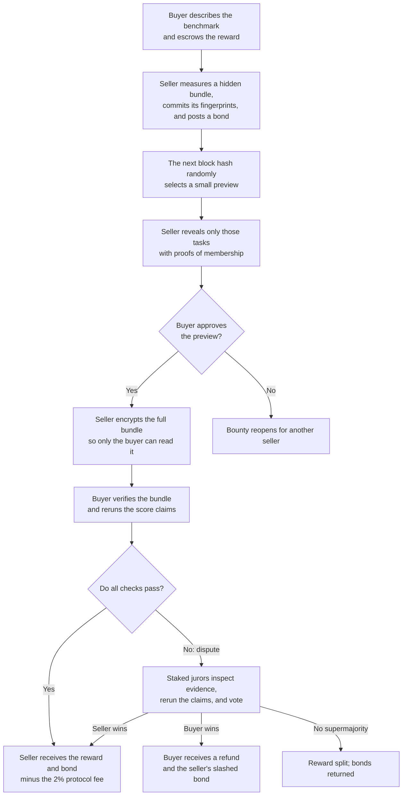

# EvalBounty

### A sealed marketplace for AI evaluation tasks

[**Live app**](https://evalbounty.vercel.app) ·
[**Demo video**](https://youtu.be/m-j7Af66_Rg) ·
[**Sepolia market**](https://sepolia.etherscan.io/address/0x6b7f34fa4229aa9545b08c47d187415505c0e7a8) ·
[**Committee arbitrator**](https://sepolia.etherscan.io/address/0x522A3853bAe72170BE0dCA60D141329bC5AfD7f0)

EvalBounty is a marketplace where AI labs buy private benchmark questions from
evaluation researchers. These questions are valuable only while they remain
unseen: showing the whole bundle before payment lets a buyer take it for free,
but paying first lets a dishonest seller deliver junk. EvalBounty handles that
trade with on-chain escrow, seller collateral, a random preview, encrypted
delivery, and evidence-backed disputes.

Built for Blockchain at Berkeley's **Black Box Bazaar** technical take-home.

## Chosen vertical: private AI evaluations

AI teams need fresh tasks that reveal where their models fail. EvalBounty lets
a buyer request a bundle with measurable requirements—for example, 30 tasks on
which a weak model scores at most 35%, a strong model scores at least 65%, and a
trivial baseline scores at most 10%.

- **Buyer:** an AI lab or model developer seeking unseen tests.
- **Seller:** a researcher who creates and measures those tests.
- **Jurors:** staked evaluators who independently check a disputed trade.

The demo uses committed snapshots of
[BIG-Bench Hard](https://github.com/suzgunmirac/BIG-Bench-Hard) and
[GSM8K](https://github.com/openai/grade-school-math). They demonstrate the
mechanism, not novelty; a real seller would supply unpublished tasks. Dataset
provenance and licenses are recorded in
[`agents/data/SOURCES.json`](agents/data/SOURCES.json).

## How a trade works



1. **The buyer defines success and deposits the reward.** The request fixes the
   task count, model identities, score bands, repetition count, grading rules,
   and an X25519 public encryption key. The rules cannot be changed after the
   buyer sees the product.

2. **The seller locks in a hidden bundle and collateral.** The seller posts a
   bond worth at least half the reward, a Keccak-256 fingerprint of the complete
   bundle, and a Merkle root representing every indexed task. Changing even one
   item later breaks those fingerprints.

3. **The blockchain chooses a preview.** A hash from the block after the
   commitment selects unique task indices. The seller committed before that
   hash existed, so it cannot know which tasks will be inspected. Merkle proofs
   show that each previewed task really came from the locked bundle.

4. **The seller delivers privately.** After preview approval, the full bundle
   is encrypted with authenticated secret-box encryption. Its one-time key is
   sealed to the buyer's X25519 public key. Anyone can see the ciphertext in the
   transaction log, but normally only the buyer can decrypt it.

5. **The buyer verifies before releasing payment.** The buyer checks the
   original bundle fingerprint, reconstructs the Merkle root, validates the
   schema, and reruns the declared weak-model, strong-model, and baseline
   scores. A valid bundle pays the seller; the contract takes a 2% fee.

6. **A disagreement goes to arbitration.** The buyer posts a dispute bond and
   evidence. Selected jurors receive the bundle key, repeat the checks, and use
   commit-reveal voting so they cannot copy one another's votes. Timeouts let
   either side finalize the trade if the other disappears.

## Biggest design decision

> **The buyer must define a machine-checkable version of value before seeing
> the product, and the protocol enforces only that definition.**

Bundle identity can be proven with hashes. Model scores can be rerun under
pinned settings. Whether a task is insightful or commercially useful is a
human judgment, so the protocol does not pretend to prove it on-chain. Instead,
the random preview makes low-quality submissions economically risky.

This also keeps the normal path inexpensive: honest parties settle without an
arbitrator, while only challenged trades pay for juror work.

## Trust assumptions

1. **Model runs are reproducible enough.** Closed model providers do not offer a
   cryptographic proof of execution and may change over time. Score tolerances
   and repeated runs reduce variance but cannot eliminate provider drift.
2. **At least two-thirds of selected stake is honest.** Jurors are drawn from a
   pre-staked pool, vote by commit-reveal, and can be slashed for failing to
   reveal or voting against a coherent supermajority.
3. **Future block hashes are acceptable demo randomness.** A block proposer has
   limited influence over them. A production version should use a VRF or a
   stronger randomness beacon.
4. **The buyer does not resell the plaintext.** Encryption protects delivery,
   not information after legitimate decryption.
5. **Wallet reputation is not real-world identity.** Settlement and dispute
   history add useful friction, but a seller can start again from a new wallet.

## One important limitation

> **EvalBounty proves consistent delivery and enforces declared score claims;
> it cannot prove that every task is meaningful, genuinely new, or still secret
> after purchase.**

A bundle can satisfy its numerical score bands yet still disappoint a buyer.
Sampling, collateral, and reputation make that behavior costly, but subjective
quality and permanent exclusivity are not cryptographically enforceable.

## Arbitration and live evidence

New trades use the
[`CommitteeArbitrator`](https://sepolia.etherscan.io/address/0x522A3853bAe72170BE0dCA60D141329bC5AfD7f0),
which implements the [ERC-792](https://eips.ethereum.org/EIPS/eip-792) ruling
interface and emits [ERC-1497](https://eips.ethereum.org/EIPS/eip-1497)
evidence events. Stake-weighted juror selection uses a future block hash; a
two-thirds vote decides the case. Ruling `1` pays the seller, ruling `2` refunds
the buyer and slashes the seller, and ruling `0` splits the reward because no
coherent supermajority formed.

A complete committee dispute is visible on Sepolia:
[dispute opened](https://sepolia.etherscan.io/tx/0xdcf1df94cd559eb76a96a58595abdd0fd089aeecf7076255f3513be0e0409f68) →
[panel drawn](https://sepolia.etherscan.io/tx/0x810eea6b8e4bbc92fa71d6a634ec86c9f90fbd36042208dda3c44c1166a6af02) →
[key sealed to jurors](https://sepolia.etherscan.io/tx/0xc366d9d542c04b0ac27a90344b22daf5c8120bc0bfddfa2931ad6bd52484813a) →
[unanimous buyer ruling](https://sepolia.etherscan.io/tx/0xc582f0a2eb6f8ee8f040cdf2971271ad9f52b180e0e37e7ea5c0dcf91d0614a5).

The earlier `CentralizedArbitrator` remains deployed only for legacy bounties
`#0`–`#10`; it is not the security model for new trades. See
[`ARBITRATION.md`](ARBITRATION.md) for the jury economics and evidence policy.

## Repository map

```text
contracts/   Solidity marketplace, arbitrators, deployment code, and tests
agents/      TypeScript buyer, seller, jurors, crypto, models, and E2E stories
dashboard/   Static read-only explorer reconstructed from contract events
scripts/     Secret entry, verification, deployment, and safety checks
```

The market state machine lives in
[`EvalBounty.sol`](contracts/src/EvalBounty.sol). The autonomous roles are
implemented in [`buyer.ts`](agents/src/buyer.ts),
[`seller.ts`](agents/src/seller.ts), and
[`juror.ts`](agents/src/juror.ts). The full byte formats, hashing rules,
sampling algorithm, and agent pseudocode are specified in
[`PROTOCOL.md`](PROTOCOL.md).

## Run and verify

Prerequisites: Node.js 22+, pnpm 10, and
[Foundry](https://book.getfoundry.sh/getting-started/installation).

```bash
git submodule update --init --recursive
pnpm install

pnpm --filter agents typecheck
forge test --root contracts -vv
pnpm --filter agents test
pnpm --filter agents e2e
```

The suites cover **48 Solidity tests**, **44 TypeScript tests**, and **5 complete
E2E stories** on a fresh local Anvil chain: successful settlement, rejected
junk plus refill, false-score dispute, committee arbitration, and invalid
encrypted delivery.

Live Sepolia agents read the gitignored `agents/.env`. Start from
[`agents/.env.example`](agents/.env.example), use `./scripts/set-keys.sh` for
hidden secret entry, and follow [`SUBMISSION.md`](SUBMISSION.md) for the exact
deployment and demo commands. Never commit wallet or model-provider keys.

## Deployment and deeper documentation

- **Network:** Ethereum Sepolia (`chainId 11155111`)
- **Market:** [`0x6b7f…e7a8`](https://sepolia.etherscan.io/address/0x6b7f34fa4229aa9545b08c47d187415505c0e7a8), deployed at block `11679290`
- **Source verification:** [Etherscan](https://sepolia.etherscan.io/address/0x6b7f34fa4229aa9545b08c47d187415505c0e7a8#code) · [Blockscout](https://eth-sepolia.blockscout.com/address/0x6b7f34fa4229aa9545b08c47d187415505c0e7a8?tab=contract)

Further reading:

- [`PROTOCOL.md`](PROTOCOL.md) — normative protocol for third-party agents.
- [`ARBITRATION.md`](ARBITRATION.md) — committee mechanics and threat model.
- [`SUBMISSION.md`](SUBMISSION.md) — testnet evidence and demo runbook.
- [`CLAUDE.md`](CLAUDE.md) — architecture and contributor conventions.
