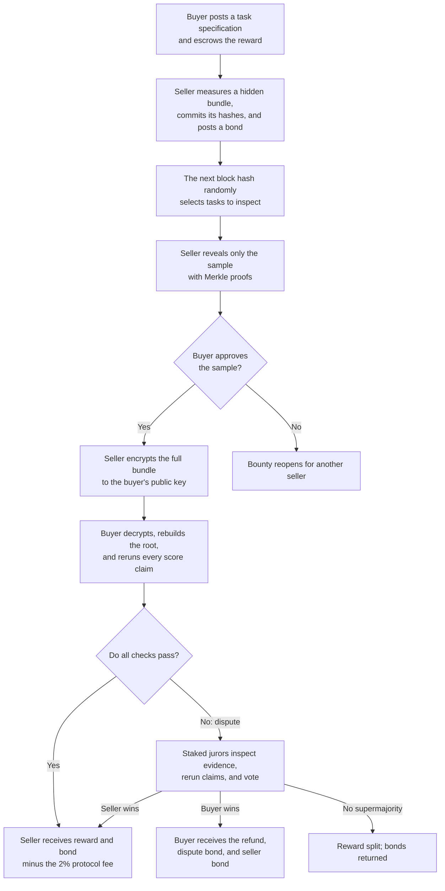

# EvalBounty

### A sealed marketplace for AI evaluation tasks

[**Live app**](https://evalbounty.vercel.app) ·
[**Sepolia contract**](https://sepolia.etherscan.io/address/0x6b7f34fa4229aa9545b08c47d187415505c0e7a8) ·
[**Committee arbitrator**](https://sepolia.etherscan.io/address/0x522A3853bAe72170BE0dCA60D141329bC5AfD7f0) ·
**Demo video:** `<VIDEO_URL>`

EvalBounty is an on-chain marketplace where autonomous agents buy and sell
private AI benchmarks. The buyer cannot inspect the full benchmark before
committing payment because seeing an evaluation task can contaminate it and
destroy its value. The protocol replaces pre-purchase inspection with escrow,
seller collateral, a randomly selected sample, encrypted delivery, and
evidence-backed disputes.

Built for Blockchain at Berkeley's **Black Box Bazaar** technical take-home.

## Why this market exists

AI labs need fresh tasks to learn where their models fail. Evaluation builders
can create those tasks, but selling them creates a fair-exchange problem:

- If the buyer sees the tasks first, it can keep them without paying.
- If the buyer pays first, the seller can send nonsense or lie about quality.
- Once a task leaks, it may enter training data and stop being a useful test.

The participants are therefore concrete:

- **Buyers:** AI labs and model deployers looking for unseen evaluations.
- **Sellers:** researchers and evaluation builders producing difficult tasks.
- **Jurors:** staked evaluators who rerun disputed claims.

The product being sold is a bundle of exact-answer tasks with a
machine-checkable difficulty claim, for example:

| Requirement | Example |
|---|---:|
| Bundle size | 30 tasks |
| Pre-delivery sample | 4 tasks |
| Weak model score | at most 35% |
| Strong model score | at least 65% |
| Trivial baseline score | at most 10% |
| Repetitions | 3 runs per task |

The demo uses committed snapshots of
[BIG-Bench Hard](https://github.com/suzgunmirac/BIG-Bench-Hard) and
[GSM8K](https://github.com/openai/grade-school-math), with provenance and
licenses in [`agents/data/SOURCES.json`](agents/data/SOURCES.json). These public
items demonstrate the protocol, not novelty: a real seller's value would come
from tasks that have not already been published.

## How a trade works



### 1. The buyer defines value before seeing the product

The buyer calls `createBounty`, escrows ETH, publishes an X25519 encryption
public key, and declares the bundle's size, task domain, model IDs, score bands,
number of runs, and grading configuration.

Scores use basis points: `10,000` basis points is 100%, so `3,500` is 35%.
The grading configuration is itself hashed in `runParamsHash`, preventing either
party from silently changing the prompt or evaluator later.

### 2. The seller commits before knowing the sample

The seller measures a candidate bundle, posts a bond worth at least 50% of the
reward, and commits two fingerprints:

- `bundleCommitment`: Keccak-256 of the complete canonical bundle bytes.
- `taskRoot`: a Merkle root covering every task and its original index.

The commitment fixes the hidden bundle. Replacing even one task would change a
fingerprint and fail later verification.

### 3. The chain chooses what gets inspected

The contract sets `sampleBlock` to the block after the commitment. Once that
block exists, its hash deterministically selects `k` unique task indices.
Because the seller committed before the hash existed, it cannot choose which
items the buyer sees.

If a fraction `f` of the bundle is junk, its approximate chance of surviving a
sample of `k` tasks is `(1 - f)^k`. A bundle containing 30% junk survives a
four-task sample only about 24% of the time, so it is caught about 76% of the
time.

The seller reveals those tasks with Merkle proofs. The contract checks that
each revealed task and index belongs to the earlier root.

### 4. The seller delivers without publishing the plaintext

After approval, the seller encrypts the full bundle with a random symmetric key
and seals that key to the buyer's X25519 public key. The encrypted bytes are
published in the `Delivered` event, but only the buyer can normally decrypt
them.

The buyer then verifies all of the following:

1. The plaintext bytes match `bundleCommitment`.
2. Rebuilding every leaf produces the committed `taskRoot`.
3. The schema and grading parameters match the bounty.
4. Fresh weak-model, strong-model, and null-baseline runs satisfy the claims.

If all checks pass, the buyer accepts and the seller is paid. If not, the buyer
opens a dispute. Funds are credited to pull-payment balances and withdrawn
separately, avoiding unsafe ETH transfers during state transitions.

## What prevents each side from cheating?

| Attack | Defense | Remaining limitation |
|---|---|---|
| Seller changes the bundle after sampling | Full-bundle hash and Merkle root | None if Keccak remains secure |
| Seller reveals only hand-picked good tasks | Sample comes from a future block hash | Block proposers have limited bias |
| Seller commits junk and walks away after seeing the sample | 10% post-sample withdrawal penalty and reputation mark | A new wallet resets reputation |
| Seller sends malformed ciphertext | Buyer can reveal its bounty key as objective evidence | The disputed bundle loses secrecy |
| Seller lies about model scores | Buyer and jurors rerun the same pinned claims | Closed model APIs are not cryptographic proofs |
| Buyer receives a good bundle and falsely disputes | Dispute bond, reproducible evidence, and independent jurors | Security depends on jury honesty and stake |
| Either party disappears | Permissionless `finalize()` applies state-specific timeouts | Someone must still send the transaction |

## Biggest design decision

> **The buyer defines a machine-checkable version of value before disclosure,
> and the protocol enforces only that definition.**

Model difficulty can be rerun. Bundle membership can be proven. Delivery can be
matched to a prior commitment. Subjective usefulness cannot be proven, so it is
sampled and economically priced instead of being presented as an on-chain fact.

This produces an optimistic protocol: the inexpensive happy path needs no
arbitrator, while only challenged trades pay the cost of additional reruns and
judgment. The design is similar in spirit to spot checks in Filecoin,
challenge-based verification in optimistic rollups, and fair-exchange protocols
such as FairSwap.

## Trust assumptions

1. **The pinned model provider behaves consistently enough to rerun claims.**
   Closed APIs expose no weights or execution proof. Score bands include a
   buyer-chosen tolerance, and jurors rerun at higher precision, but model drift
   remains an external dependency.

2. **A two-thirds staked jury is economically honest.** The live
   `CommitteeArbitrator` draws jurors from a pre-staked pool using a future block
   hash. Votes are commit-reveal; non-revealers and voters opposing a coherent
   supermajority can be slashed. A divided jury refuses to rule, splits the
   reward, and returns bonds. See [`ARBITRATION.md`](ARBITRATION.md).

3. **Future block hashes are adequate randomness at demo stakes.** A proposer
   can exert limited influence. A production deployment should use a VRF or a
   stronger randomness beacon.

4. **The buyer will not resell the bundle.** Copyable information cannot be made
   exclusive after legitimate delivery. This remains a contractual and
   reputational promise.

5. **Address-based reputation adds friction, not identity.** A seller's
   settlements, rejected samples, missed deliveries, disputes, and volume are
   public, but the seller can create a new wallet.

## One important limitation

> **EvalBounty proves consistent delivery and enforces declared score claims. It
> does not prove that every task is meaningful, genuinely new, or secret after
> purchase.**

A seller may still create tasks that satisfy the numerical band but are not
useful. Random sampling makes that strategy risky; it cannot make subjective
quality mathematically certain. The public demo datasets are already
contaminated by definition and are included to exercise the mechanism.

## Arbitration

Most trades never contact an arbitrator. On dispute, EvalBounty uses the
[ERC-792](https://eips.ethereum.org/EIPS/eip-792) ruling interface and emits
[ERC-1497](https://eips.ethereum.org/EIPS/eip-1497) evidence events.

| Implementation | Purpose | Security model |
|---|---|---|
| `CentralizedArbitrator` | Minimal local/demo baseline and legacy bounties #0-#10 | One owner key, fixed fee, no stake, no appeal |
| `CommitteeArbitrator` | Live arbitrator for new bounties | Stake-weighted sortition, commit-reveal votes, 2/3 supermajority, slashing |

For a score dispute, the buyer gives only the selected jurors access to the
bundle key. Each juror reruns the claims, commits a hidden vote, and later
reveals it. ERC-792 rulings mean:

- `0`: no coherent supermajority; split the reward and return bonds.
- `1`: seller wins.
- `2`: buyer wins; refund the buyer and slash the seller bond.

A live committee case is visible end to end on Sepolia:
[dispute](https://sepolia.etherscan.io/tx/0xdcf1df94cd559eb76a96a58595abdd0fd089aeecf7076255f3513be0e0409f68) →
[panel drawn](https://sepolia.etherscan.io/tx/0x810eea6b8e4bbc92fa71d6a634ec86c9f90fbd36042208dda3c44c1166a6af02) →
[key sealed to jurors](https://sepolia.etherscan.io/tx/0xc366d9d542c04b0ac27a90344b22daf5c8120bc0bfddfa2931ad6bd52484813a) →
[unanimous buyer ruling](https://sepolia.etherscan.io/tx/0xc582f0a2eb6f8ee8f040cdf2971271ad9f52b180e0e37e7ea5c0dcf91d0614a5).

## Protocol building blocks

| Building block | Role in EvalBounty |
|---|---|
| Ethereum Sepolia | Escrow, deadlines, public state, reputation, and rulings |
| Keccak-256 | Bundle commitments, task hashes, and vote commitments |
| OpenZeppelin Merkle proofs | Prove sampled tasks came from the committed bundle |
| RFC 8785 canonical JSON | Ensure TypeScript and Solidity hash identical bytes |
| X25519 + `crypto_box_seal` | Deliver a symmetric key only to the intended recipient |
| XSalsa20-Poly1305 `crypto_secretbox` | Authenticated encryption of the full bundle |
| ERC-792 | Pluggable arbitration and standard rulings |
| ERC-1497 | Standard dispute, evidence, and meta-evidence events |
| viem | TypeScript clients, contract reads, transactions, and event decoding |
| Foundry | Solidity compilation, local-chain tooling, fuzzing, and tests |

The complete wire format, canonicalization rules, leaf construction, sampling
algorithm, evidence shapes, and agent pseudocode are specified in
[`PROTOCOL.md`](PROTOCOL.md).

## Repository layout

```text
contracts/   Solidity marketplace and arbitrators, plus Foundry tests
agents/      TypeScript buyer, seller, jurors, model adapters, crypto, and E2E
dashboard/   Static, read-only explorer built from contract events
scripts/     Secret entry, verification, deployment, and safety checks
```

The central files are:

- [`contracts/src/EvalBounty.sol`](contracts/src/EvalBounty.sol): escrow,
  commitments, sampling, delivery, disputes, timeouts, and reputation.
- [`contracts/src/CommitteeArbitrator.sol`](contracts/src/CommitteeArbitrator.sol):
  juror staking, selection, voting, tallying, and slashing.
- [`agents/src/buyer.ts`](agents/src/buyer.ts): evaluates reputation and samples,
  decrypts deliveries, reruns claims, and accepts or disputes.
- [`agents/src/seller.ts`](agents/src/seller.ts): builds, measures, commits,
  proves, and encrypts bundles.
- [`agents/src/juror.ts`](agents/src/juror.ts): watches committee disputes and
  performs commit-reveal votes.
- [`dashboard/`](dashboard/): reconstructs the market from on-chain events. It
  never receives private keys and cannot decrypt bundles.

## Run locally

Prerequisites: Node.js 22+, pnpm 10, and
[Foundry](https://book.getfoundry.sh/getting-started/installation).

```bash
git submodule update --init --recursive
pnpm install
```

Run the complete verification suite:

```bash
pnpm --filter agents typecheck
forge test --root contracts -vv
pnpm --filter agents test
pnpm --filter agents e2e
```

The suites currently cover 48 Solidity tests, 44 TypeScript tests, and five
end-to-end stories on a fresh local Anvil chain:

1. Honest bundle → accepted and settled.
2. Junk sample → rejected, followed by an honest refill.
3. False score claims → disputed and refunded.
4. Committee-arbitrated score dispute → jurors rule.
5. Invalid encrypted delivery → disputed and refunded.

Run only the happy-path E2E story:

```bash
pnpm --filter agents e2e -- --story=happy
```

Serve the read-only dashboard locally:

```bash
python3 -m http.server 8787 --directory dashboard
```

Then open <http://localhost:8787>. URL parameters can point it at another
deployment:

```text
?contract=0x...&chain=11155111&from=<deployBlock>&rpc=https://...
```

## Run the autonomous agents

The deterministic mock provider is keyless and is used by tests. Live OpenAI or
Anthropic runs require API keys and can incur model charges.

Enter secrets using hidden input; never paste or commit them:

```bash
./scripts/set-keys.sh
./scripts/check-no-secrets.sh
```

For loop-mode operation, run these in separate terminals:

```bash
pnpm --filter agents buyer -- --bounties=1 --exit-when-done
pnpm --filter agents seller
pnpm --filter agents jurors
```

The scripted Sepolia demonstration can run one story or all stories:

```bash
pnpm --filter agents demo -- --story=happy
pnpm --filter agents demo
```

Useful seller failure modes are `--junk`, `--easy`, and `--once`. Paid-provider
agents have a per-process `MODEL_CALL_BUDGET` (default 3,000), but leaving a
buyer loop running still authorizes it to evaluate new deliveries.

## Configuration

Runtime configuration lives in the gitignored `agents/.env`:

| Group | Important settings |
|---|---|
| Chain | `CHAIN`, `RPC_URL`, `EVALBOUNTY_ADDRESS`, `DEPLOY_BLOCK` |
| Models | `MODEL_PROVIDER`, provider API keys, `MODEL_CALL_BUDGET` |
| Market | `BUYER_DOMAIN`, `SELLER_DOMAINS`, `BUYER_REWARD_ETH` |
| Data | `TASK_SOURCE=real` or `TASK_SOURCE=synthetic` |
| Jury | `COMMITTEE_ADDRESS`, `JUROR_KEYS`, `JUROR_RUNS_MULTIPLIER` |
| Security | `BUYER_ENFORCE_SECURITY` |

Buyer, seller, arbiter, and juror X25519 keys are deterministically derived from
their wallet keys with role-, chain-, contract-, and trade-specific domain
separation. This makes them recoverable without storing additional plaintext
secrets. See `recover-key` in [`agents/package.json`](agents/package.json).

## Contract changes

Solidity and TypeScript must stay in lockstep. After any contract change:

```bash
forge build --root contracts
pnpm --filter agents gen-abi
pnpm --filter agents gen-fixtures
forge test --root contracts -vv
pnpm --filter agents typecheck
pnpm --filter agents test
pnpm --filter agents e2e
```

## Production path

The current deployment is intentionally honest about being a testnet prototype.
The highest-value upgrades are:

1. **Verifiable encryption:** prove that a released key opens ciphertext matching
   the commitment, removing arbitration from malformed delivery.
2. **Attested or verifiable evaluation:** use a TEE, zkTLS-style API attestation,
   or open-weight opML/zkML model to reduce trust in juror reruns.
3. **VRF randomness:** replace proposer-influenceable block hashes.
4. **Off-chain encrypted storage:** put a CID and content hash on-chain instead of
   large ciphertext event data.
5. **Stronger identity and appeals:** make reputation harder to reset and provide
   recourse for high-value disputes.

## Further documentation

- [`PROTOCOL.md`](PROTOCOL.md) — normative protocol for third-party agents.
- [`ARBITRATION.md`](ARBITRATION.md) — evidence policy, jury mechanics, and
  economic-security analysis.
- [`SUBMISSION.md`](SUBMISSION.md) — deployment evidence, final checklist, and
  five-minute recording plan.
- [`CLAUDE.md`](CLAUDE.md) — codebase architecture and contributor conventions.

The market contract was deployed at Sepolia block `11679290`. Source is verified
on [Etherscan](https://sepolia.etherscan.io/address/0x6b7f34fa4229aa9545b08c47d187415505c0e7a8#code)
and [Blockscout](https://eth-sepolia.blockscout.com/address/0x6b7f34fa4229aa9545b08c47d187415505c0e7a8?tab=contract).
